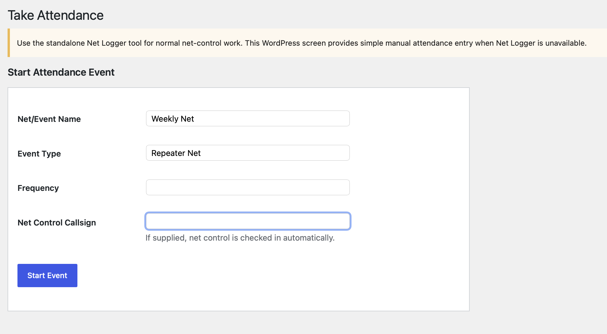
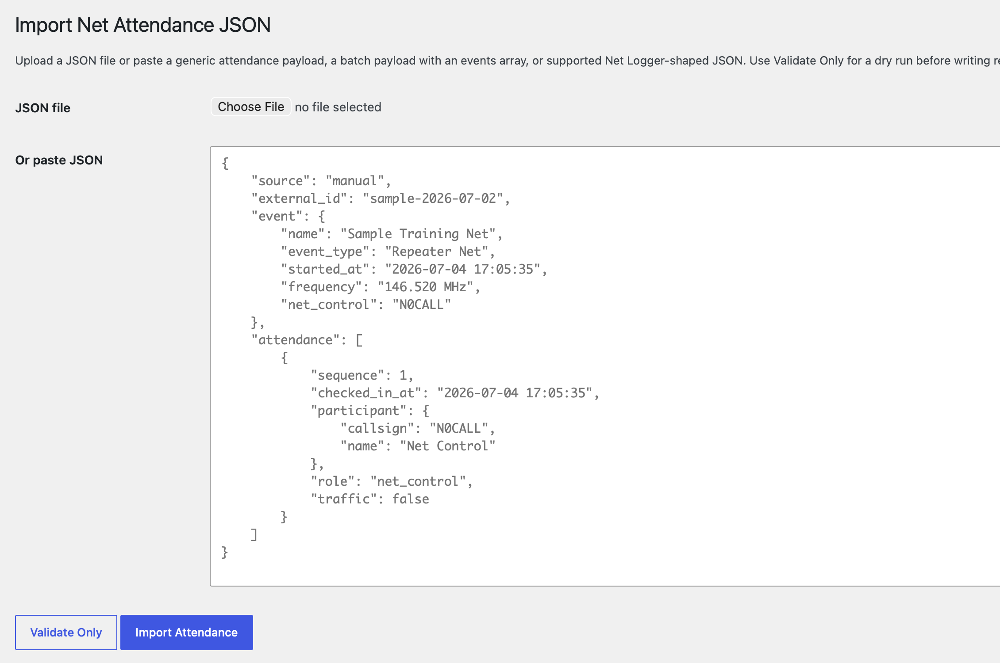
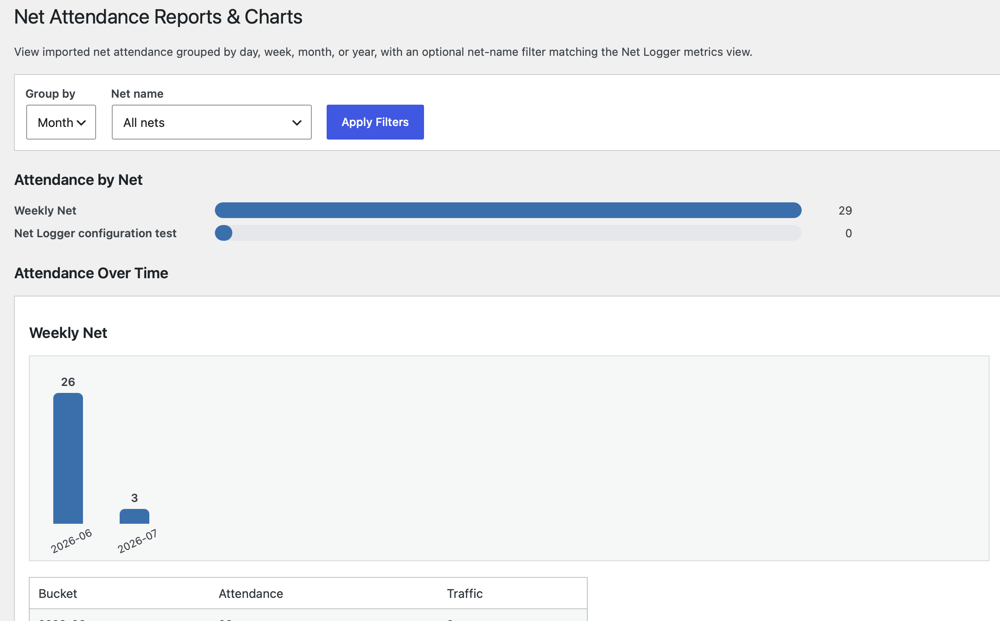

# Net & Meeting Attendance Usage

## What the plugin does today

The current MVP can:

- store attendance events, participants, and attendance records in custom WordPress tables;
- import JSON from the wp-admin import page;
- validate imports before writing records;
- display imported events and attendance in wp-admin;
- delete attendance events and their attached attendance records from wp-admin;
- show reports/charts in wp-admin;
- embed frontend reports/charts on normal WordPress pages using a shortcode;
- provide a rapid summary entry form for historical or paper-log nets with only date/time, name, frequency, and head count;
- provide a simple manual attendance-taking screen for use when Net Logger is unavailable.

The current MVP intentionally does not try to replicate the full standalone Net Logger interface. Operators should still use Net Logger for normal net operations and use the WordPress attendance screen only when Net Logger is unavailable.

## Admin pages

After activation, administrators should see a `Net Attendance` menu in wp-admin.

Main pages:

```text
/wp-admin/admin.php?page=net-attendance-logger
/wp-admin/admin.php?page=net-attendance-logger-take-attendance
/wp-admin/admin.php?page=net-attendance-logger-rapid-entry
/wp-admin/admin.php?page=net-attendance-logger-import
/wp-admin/admin.php?page=net-attendance-logger-reports
```

### Events page

The Events page lists imported/stored attendance events, including a clear open/closed status column. From there, open an event to see its participant attendance records.

Administrators can delete an attendance event from either the event list or the event detail page. Deleting an event also deletes the attendance records attached to that event. Participant records are left in place so later imports or manual check-ins can reuse the same stations.

### Take Attendance page



The Take Attendance page is intentionally simple and manual:

```text
/wp-admin/admin.php?page=net-attendance-logger-take-attendance
```

Use the standalone Net Logger tool for normal net-control work. Use this WordPress screen only in a pinch when Net Logger is unavailable.

Manual attendance workflow:

1. Start an attendance event with net/event name, event type, frequency, and optional net-control callsign.
2. If a net-control callsign is supplied, the plugin checks that callsign in automatically with the `net_control` role.
3. Use the Quick Check-in row at the top to type a callsign and press Enter for fast keyboard-first entry.
4. Callsign fields auto-uppercase and the cursor returns to the callsign field after each save.
5. Use the detailed check-in section only when name, city, state, traffic, traffic details, or notes need to be entered with the check-in.
6. Edit traffic/notes inline if needed.
7. Remove mistaken check-ins before the event is closed.
8. Close the event when the net is finished.
9. Closed events are locked against check-in edits until an administrator deliberately clicks Reopen Event for Editing.
10. Use the normal Events and Reports pages to review the saved attendance.

On the event detail page, Traffic values with details show as `Yes - view`; expand that control to read the traffic text without leaving the attendance table.

### Rapid Summary Entry page

Use Rapid Summary Entry when you have a historical paper log, meeting roster, or off-system net where individual callsigns were not captured but the total attendance is reliable.

```text
/wp-admin/admin.php?page=net-attendance-logger-rapid-entry
```

Rapid Summary Entry stores:

- date/time;
- net or event name;
- event type;
- frequency;
- total head count;
- optional source notes.

The saved event is marked as a summary-only event. It does not create participant or check-in rows, but reports and charts include the aggregate head count so historical totals remain accurate without pretending individual attendance records exist.

The rapid workflow is not a substitute for full participant-level logging when callsigns, traffic notes, or check-in sequence are available. Use Net Logger imports or the Take Attendance page for those details.

The manual attendance screen does not include drag/drop, FCC lookup, advanced station management, or a full Net Logger-style board.

### Import JSON page



The Import JSON page accepts:

- pasted JSON;
- uploaded `.json` files;
- single-event payloads;
- batch payloads with an `events` array.

Use `Validate Only` before running a real import.

### Reports & Charts page



The reports page shows:

- attendance totals by net/event name;
- attendance over time;
- grouping by day, week, month, or year;
- optional filtering by exact imported event name.

Reports bucket attendance by `checked_in_at`, falling back to the event `started_at` when a record lacks its own check-in timestamp.

## Shortcodes

### Frontend reports shortcode

Use this shortcode on a normal WordPress page:

```text
[net_attendance_reports]
```

Example page setup:

1. Create a page named `Net Attendance Reports`.
2. Add a Shortcode block or Paragraph block containing:

   ```text
   [net_attendance_reports]
   ```

3. Publish the page.
4. Add the page to the site menu through Appearance → Menus or Appearance → Editor → Navigation, depending on the active theme.
5. Restrict the page to DETARC members if the site is using page-level restrictions.

The shortcode itself performs its own access check, so report output is still protected even if the page is accidentally visible in a public menu.

### Shortcode attributes

Supported attributes:

```text
period="day|week|month|year"
event_name="Exact imported event name"
show_filters="yes|no"
```

Examples:

```text
[net_attendance_reports period="week"]
[net_attendance_reports period="month" event_name="Weekly Net"]
[net_attendance_reports period="year" show_filters="no"]
```

If filters are shown, users can change the grouping period and event-name filter in the frontend form. The form submits `period` and `event_name` query parameters to the same page.

### Access behavior

- Administrators can view reports.
- Users with `view_net_attendance_reports` can view reports.
- Users with recognized DETARC Member roles can view reports.
- Logged-out visitors see a login-required message.
- Logged-in users without permission see a not-authorized message.

## Recommended frontend report page

For the DETARC development site, create or update a page at:

```text
https://dev.detarc.net/net-attendance-reports/
```

Suggested content:

```text
[net_attendance_reports]
```

## Troubleshooting shortcode publishing

If WordPress reports:

```text
Updating failed. The response is not a valid JSON response.
```

check the browser/network response and PHP logs. Gutenberg often renders shortcode blocks through the WordPress REST API while editing. A PHP fatal or warning can corrupt the expected JSON response.

This plugin's shortcode rendering should avoid wp-admin-only helper functions in frontend/shared rendering paths.

## Current limitation: not a full Net Logger replacement

The plugin now has a simple manual attendance screen, but it intentionally does not have a live net-control board equivalent to Net Logger's two-column interface.

Future enhancements may add:

- participant search/autocomplete from the known station list;
- FCC lookup;
- optional REST endpoints for Net Logger integration;
- a more polished board if manual attendance use becomes common.

### Rapid Summary Entry behavior

Rapid Summary Entry lets an authorized WordPress user enter only:

- date/time;
- net or event name;
- frequency, when the event is an RF net;
- total head count.

This does not replace full participant-level logging, because there are no individual callsigns, traffic notes, or check-in sequence. It does let reports and charts stay current when an older paper log, meeting roster, or off-system net only has a reliable aggregate count. The implementation marks these as summary-only events so reports can include the head count without pretending individual attendance records exist.
